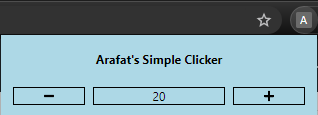

# A Simple Clicker Chrome Extension

This is a very simple project that aims to teach myself and others the basic necessities of developing a Chrome Extension by implementing a clicker app that
utilizes the chrome.storage API. Feel free to modify it as you please!

<b>How to Install</b>

<ul>
<li>Simply download the zip and extract.</li>

<li>Open your Chrome Extensions and enable developer mode.</li>

<li>Finally, click "Load Unpacked", and select the extracted root folder.</li>
</ul>

<b>Preview</b>

